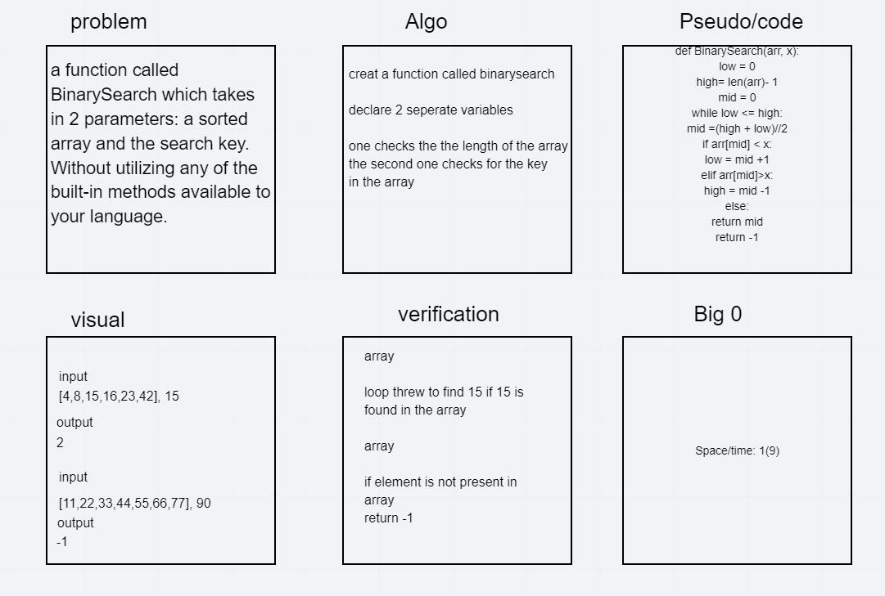

# Challenge Summary
- Iterative Binary Search Function 
- It returns index of x in given array arr if present,
- else returns -1 

## Challenge Description
- using creat Iterative Binary Search Function it takes two parametr arr and x.
- creat three variables those takes different values and i use while looping to manipolate the value and the out put of arry.

- Source: [GeeksforGeeks](https://www.geeksforgeeks.org/python-program-for-binary-search/)
- [video Tutorials]: https://www.geeksforgeeks.org/binary-search/

## Approach & Efficiency

- i use the while loop approch.its Check if x is present at arr return the index else return -1.
- Problem Domain
- Edge Cases
- VIsual
- Algorithm
- Pseudo
- Verification

## Solution
