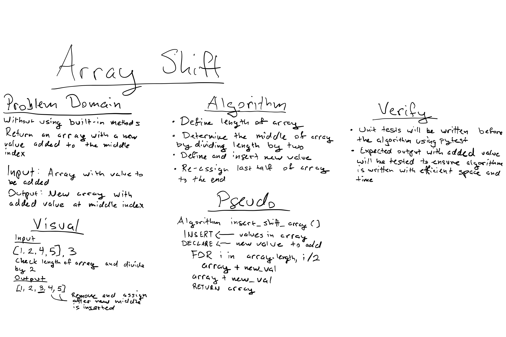

# Challenge Summary
- return an array with the new value added at the middle index

## Challenge Description
- useing the simple slicing operator 
- With this operator we use specify where to start the slicing, where to end and specify the step.
- assign a new index value to be inserted where it.

- Source: [Python Tutorials](https://www.learnbyexample.org/python-list-slicing/)

## Approach & Efficiency
- Problem Domain
- Edge Cases
- VIsual
- Algorithm
- Pseudo
- Verification

## Solution

#### Collaborate with Ben.
