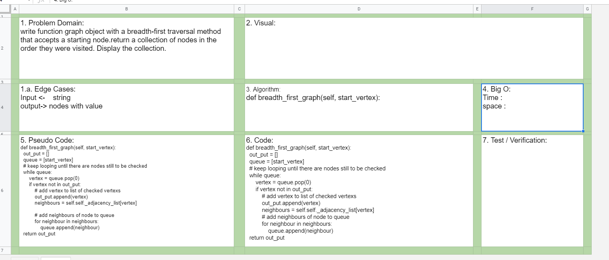

# Challenge Summary
- write function graph object with a breadth-first traversal method that accepts a starting node.return a collection of nodes in the order they were visited. Display the collection.
 

## Challenge Description for Stack class

### Sources Link:
- [Breadth First Traversal Method graph](https://pythoninwonderland.wordpress.com/2017/03/18/how-to-implement-breadth-first-search-in-python/)

- [Breadth First Search or BFS for a Graph](https://www.geeksforgeeks.org/breadth-first-search-or-bfs-for-a-graph/)

## Approach & Efficiency
- Problem Domain
- Edge Cases
- Pseudo
- code

## Solution

#### Collaborate.

/home/neba9/code-fellows/401/data-structures-and-algorithms/python/assets/breadth_first_graph.png