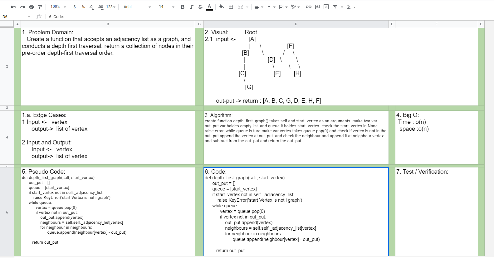

# Challenge Summary
-    Create a function that accepts an adjacency list as a graph, and conducts a depth first traversal. return a collection of nodes in their pre-order depth-first traversal order.
 

## Challenge Description for Stack class

### Sources Link:
- [Depth First Traversal Method graph](https://codereview.stackexchange.com/questions/78577/depth-first-search-in-python)

## Approach & Efficiency
- Problem Domain
- Edge Cases
- Pseudo
- code

## Solution

#### Collaborate.
