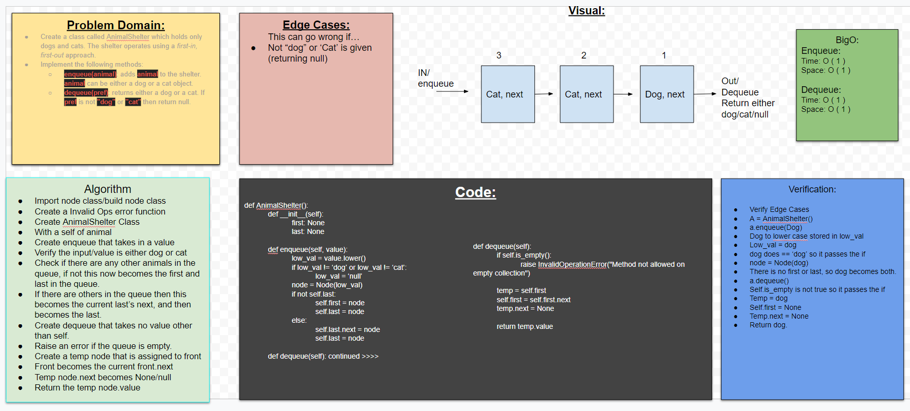

# Challenge Summary
- Create a class called AnimalShelter which holds only dogs and cats. The shelter operates using a first-in, first-out approach.
 

## Challenge Description 
- enqueue(animal): adds animal to the shelter. animal can be either a dog or a cat object.

- dequeue(pref): returns either a dog or a cat. If pref is not "dog" or "cat" then return null.

- Sources:
- [geeks for geeks](https://www.geeksforgeeks.org/queue-using-stacks/)

## Approach & Efficiency
- Problem Domain
- Edge Cases
- VIsual
- Algorithm
- Pseudo

## Solution

#### Collaborate Karlo, Anthony, Brandon and Jae.