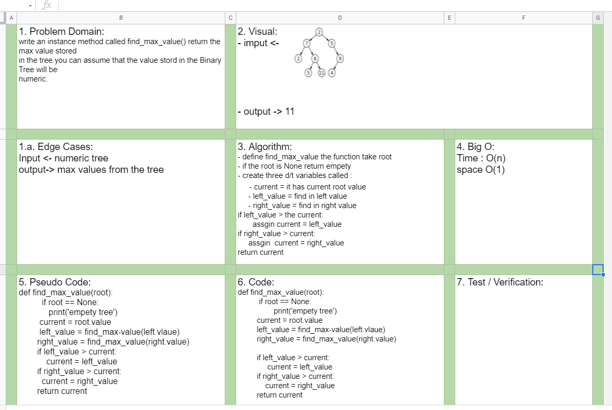

# Challenge Summary
- Write an instance method called find-maximum-value. Without utilizing any of the built-in methods available to your language, return the maximum value stored in the tree. You can assume that the values stored in the Binary Tree will be numeric.
 

## Challenge Description for Stack class

### Sources Link:
- [Find maximum (or minimum) in Binary Tree](https://www.geeksforgeeks.org/find-maximum-or-minimum-in-binary-tree/)

## Approach & Efficiency
- Problem Domain
- Edge Cases
- VIsual
- Algorithm
- Pseudo

## Solution

#### Collaborate.