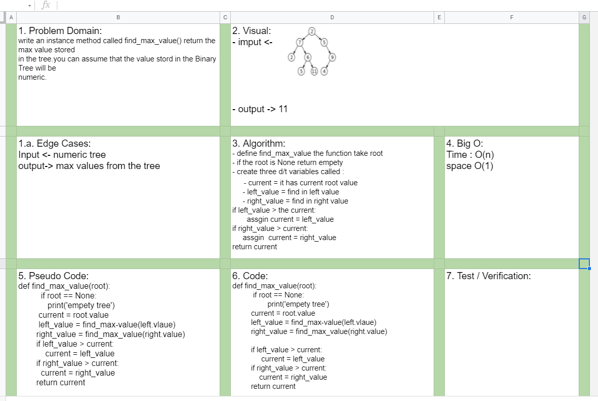

# Challenge Summary
- Write a function called FizzBuzzTree which takes a k-ary tree as an argument.
Without utilizing any of the built-in methods available to your language, determine whether or not the value of each node is divisible by 3, 5 or both. Create a new tree with the same structure as the original,
 

## Challenge Description for Stack class

- If the value is divisible by 3, replace the value with “Fizz”
- If the value is divisible by 5, replace the value with “Buzz”
- If the value is divisible by 3 and 5, replace the value with “FizzBuzz”
- If the value is not divisible by 3 or 5, simply turn the number into a String.

### Sources Link:
- [Find maximum (or minimum) in Binary Tree](https://www.geeksforgeeks.org/find-maximum-or-minimum-in-binary-tree/)

## Approach & Efficiency
- Problem Domain
- Edge Cases
- VIsual
- Algorithm
- Pseudo

## Solution

#### Collaborate.