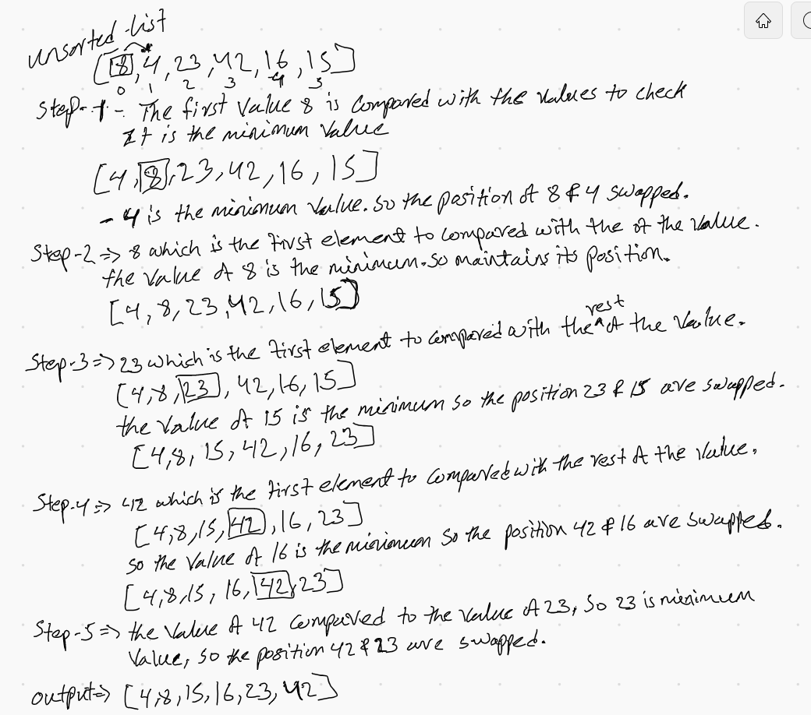

##### Given Pseudocode
```
    InsertionSort(int[] arr)
    
      FOR i = 1 to arr.length
      
        int j <-- i - 1
        int temp <-- arr[i]
        
        WHILE j >= 0 AND temp < arr[j]
          arr[j + 1] <-- arr[j]
          j <-- j - 1
          
        arr[j + 1] <-- temp
```
```
  input arrays

  [[8], 4, 23, 42, 16, 15]
```

- Spet-1 :- The value 8 is compared with the rest of the values to check it is the minimum value. 4 is the minimum value .so the position of 8 and 4 swappped.
``` 
  [4, [8], 23, 42, 16, 15]
```

- Step-2 :- 8 which is the first element to compared with the rest of the value.the value of 8 is the minimum .so mainains its position.
```
  [4, 8, 23, 42, 16, 15]
```
- step_3 :- the value of 23 which is the first element to compared with the rest of value.
```
  [4, 8, [23], 42, 16, 15]
```
so the value of 15 is the minimum so the position 23 and 15 are swapped.
```
  [4, 8, 15, 42, 16, 23]
```
- step_4 :- the value of 42 which is the first element to compared with the rest of value.
```
  [4, 8, 15, [42], 16, 23]
```
so the value of 16 is the minimum so the position 42 and 16 are swapped.
```
  [4, 8, 15, 16, 42, 23]
```
- step_5 :- the value of 42 to compared with the value of 23. 23 is minimum so the position 42 and 23 are swapped.

```
  output arrays

  [4, 8, 15, 16, 23, 42]
```


