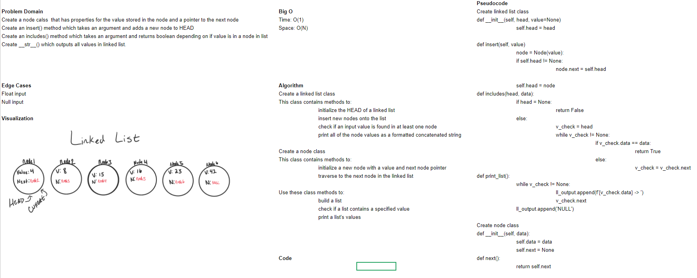
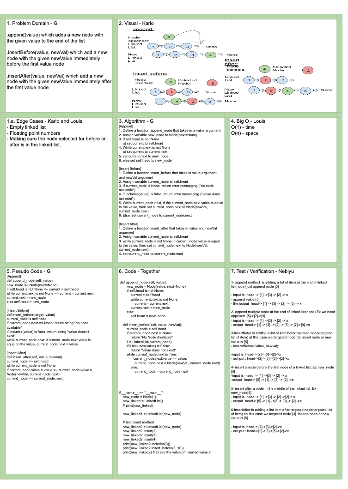
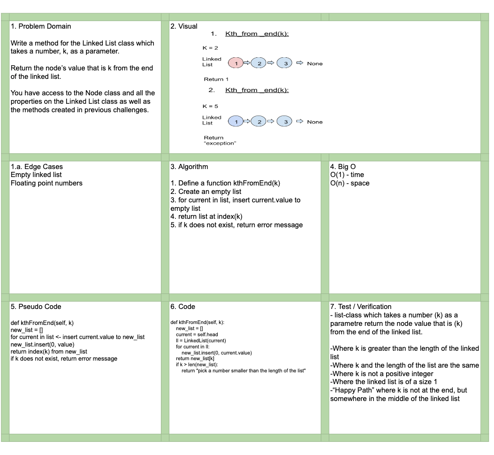

# linked list -Challenge Summary
- Create a Node class that has properties for the value stored in the Node, and a pointer to the next Node.
- need to create a class for the Linked List. This class will contain the methods to insert.
-  insert an item in a single linked list is to add an item at the start of the list. 

## linked list  -Challenge Description
- Define a method called insert which takes any value as an argument and adds a new node with that value to the head of the list with an O(1) Time performance.
- Define a method called includes which takes any value as an argument and returns a boolean result depending on whether that value exists as a Node’s value somewhere within the list.
- Define a method called toString (or __str__ in Python) which takes in no arguments and returns a string representing all the values in the Linked List, formatted as:
"{ a } -> { b } -> { c } -> NULL"

# ll-insertions lab-06 -Challenge Summary
- Can successfully add a node to the end of the linked list
- Can successfully add multiple nodes to the end of a linked list
- Can successfully insert a node before a node located i the middle of a linked list
- Can successfully insert a node before the first node of a linked list
- Can successfully insert after a node in the middle of the linked list
- Can successfully insert a node after the last node of the linked list

## ll-insertions lab-06 -Challenge Description

# ll-kth-from-end lab-07 -Challenge Summary
- Where k is greater than the length of the linked list
- Where k and the length of the list are the same
- Where k is not a positive integer
- Where the linked list is of a size 1
- “Happy Path” where k is not at the end, but somewhere in the middle of the linked list

- Sources:
- [GeeksforGeeks]https://www.geeksforgeeks.org/python-program-for-reverse-a-linked-list/)
- [RealPython](https://realpython.com/linked-lists-python/#how-to-create-a-linked-list)
- [Tutorials point](https://www.tutorialspoint.com/python_data_structure/python_linked_lists.htm)
- [stackabuse.com/](https://stackabuse.com/linked-lists-in-detail-with-python-examples-single-linked-lists/)

## Approach & Efficiency
- Problem Domain
- Edge Cases
- VIsual
- Algorithm
- Pseudo
- Verification

## Solution

#### Collaborate with Alex Angelico, Anthony Beaver, Karlo Mangubat .

#### for lab-06 and lab-07 Collaborate with Alan, Grace, Louis