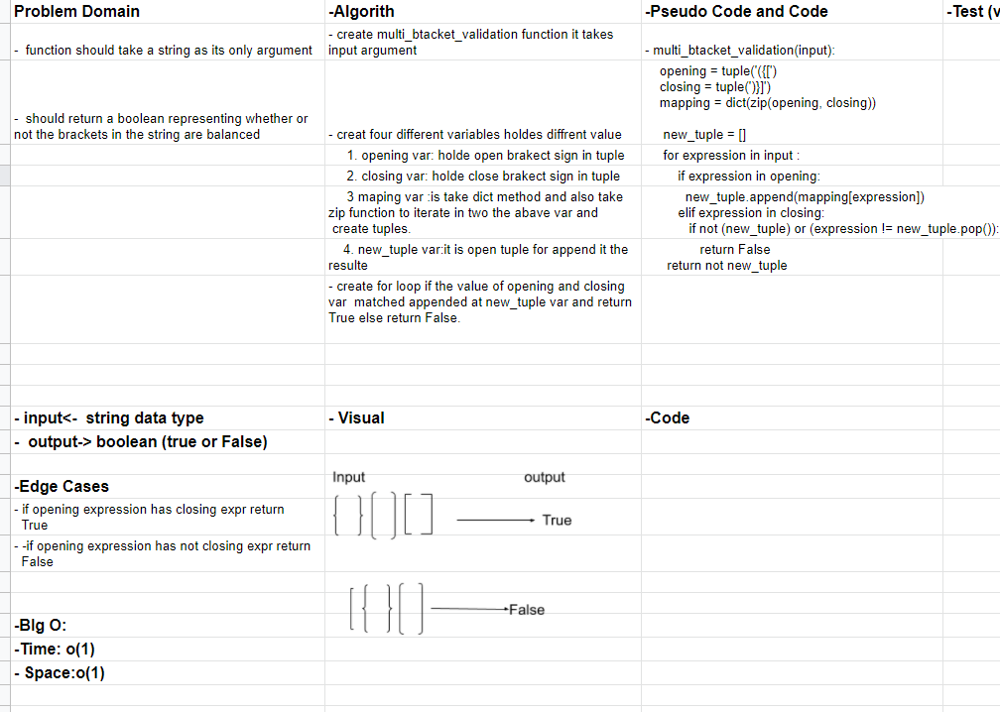

# Challenge Summary: Multi-bracket Validation.
- Create a function called multi_bracket_validation(input).Your function should take a string as its only argument, and should return a boolean representing whether or not the brackets in the string are balanced. There are 3 types of brackets:
- Round Brackets : ()
- Square Brackets : []
- Curly Brackets : {}

## Challenge Description 
- function called multi_bracket_validation(input).
it takes expression every openig expressions it should have to own closing expression if it has return True unless return False.

#### Sources:
- [Stack Exchange](https://codereview.stackexchange.com/questions/180567/checking-for-balanced-brackets-in-python)

## Approach & Efficiency
- Problem Domain
- Edge Cases
- VIsual
- Algorithm
- Pseudo

## Solution

#### Collaborate 