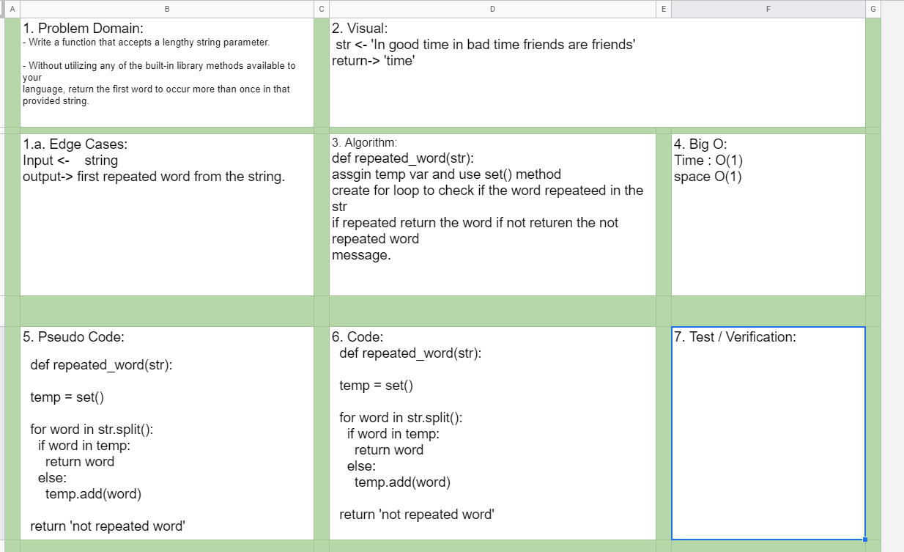

# Challenge Summary

- Write a function that accepts a lengthy string parameter.

- Without utilizing any of the built-in library methods available to your language, return the first word to occur more than once in that provided string.

Once you are done with your article, code a working, tested implementation of Merge Sort based on the pseudocode provided.

## Challenge Description for Stack class

- Utilize the Single-responsibility principle: any methods you write should be clean, reusable, abstract component parts to the whole challenge. You will be given feedback and marked down if you attempt to define a large, complex algorithm in one function definition.

- Write at least three test assertions for each method that you define.

## Time and Space Complexity of selection sort

- Time complexity Big O(1) 
- space comlexity Big O(1)

### Sources Link:
- [find the first repeated word](https://w3resource.com/python-exercises/string/python-data-type-string-exercise-55.php)

- [find the repeated word method](https://www.tutorialspoint.com/find-the-first-repeated-word-in-a-string-in-python-using-dictionary)

[set() method](https://www.geeksforgeeks.org/python-set-method/)

## Solution

#### Collaborate.

