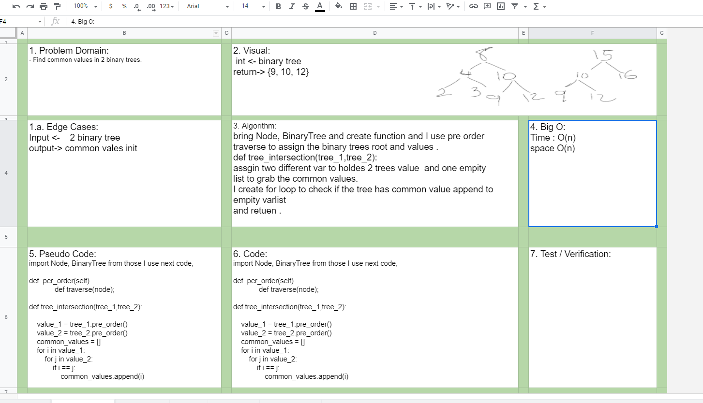

# Challenge Summary
- Write a function called tree_intersection that takes two binary tree parameters.

- Without utilizing any of the built-in library methods available to your language, return a set of values found in both trees.

## Challenge Description for Stack class

- Utilize the Single-responsibility principle: any methods you write should be clean, reusable, abstract component parts to the whole challenge. You will be given feedback and marked down if you attempt to define a large, complex algorithm in one function definition.

- Write at least three test assertions for each method that you define

## Time and Space Complexity of selection sort

- Time complexity Big O(n+m) 
  - Here ‘m’ and ‘n’ are number of nodes in first and second tree respectively,as we need to traverse both the trees.

- space comlexity Big Use of stack for storing values, at-most elements = ‘Height of tree’: O(h1+h2)

### Sources Link:
- [Print Common Nodes in Two Binary Search Trees](https://www.geeksforgeeks.org/print-common-nodes-in-two-binary-search-trees/)

## Solution

#### Collaborate.